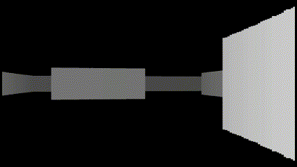
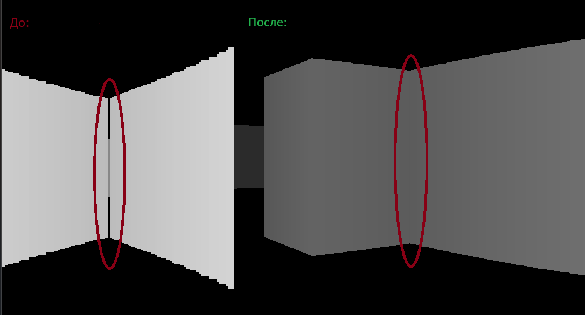
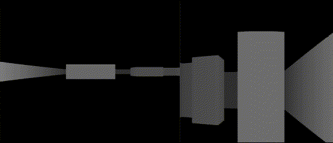
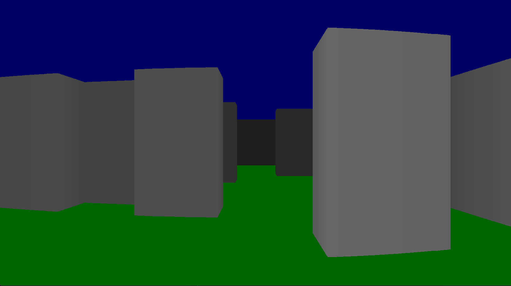

# Ray-Casting

3D Игра, написанная на *C++*,использующая алгоритм **Ray-Casting** в качестве **алгоритма рендеринга изображений по 3d модели**
____

Ray-Casting является ключевой технологией в области компьютерной графики, визуализации и разработке игр. Реализация алгоритма Ray-Casting позволит создать более реалистичные визуализации без необходимости использования сложных вычислительных методов ray-tracing. Этот проект также имеет потенциал для применения в медицине, архитектуре, индустрии развлечений и других отраслях. Алгоритм Ray-Casting также присутствует во всех игровых движках, в том числе Godot, Unity, UE и т.д.

## Что нового?

- Реализованое правильное появление окна с **нужным разрешением** для вашего монитора

- **Отсутствует консоль** рядом с окном

- **Новый, более оптимизированный** алгоритм Ray-Cast

>Видеоролик высокого качества смотреть Media/Before_vs_after.gif

В этом видеоролике выпускалось **1000 лучей**

- Больше луч **не проходит** через объект между двумя его сторонами, а также через общую точку двух объектов

- Теперь при изменении количества испускаемых лучей, **не меняется проекционная высота стен**

>Видеоролик высокого качества смотреть Media/Before_vs_after_3.gif

- Добавлены **новые краски**

## Как собрать проект

Инструкция по сборке проекта есть в файле CMakeLists.txt
