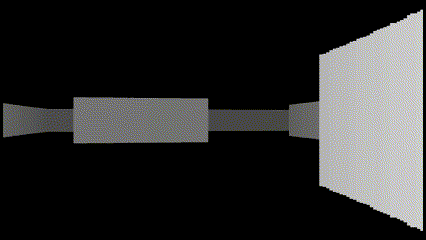

# Ray-Casting
3D Игра, написанная на *C++*,использующая алгоритм **Ray-Casting** в качестве *алгоритма рендеринга 3-ых изображений*
____

____
# Общие сведения
Игра представляет из себя 3d Карту со стенами по которой можно передвигаться.
Игра была создана на базе алгоритма Ray-Casting.

# Актуальность 
Ray-Casting является ключевой технологией в области компьютерной графики, визуализации и разработке игр. Реализация алгоритма Ray-Casting позволит создать более реалистичные визуализации без необходимости использования сложных вычислительных методов ray-tracing. Этот проект также имеет потенциал для применения в медицине, архитектуре, индустрии развлечений и других отраслях. Алгоритм Ray-Casting также присутствует во всех игровых движках, в том числе Godot, Unity, UE и т.д.

# Суть Алгоритма
Суть алгоритма Ray Casting в том, что камера, находящаяся среди объектов, испускает лучи по всей области видимости, эти лучи в свою очередь пересекаются с первыми попавшимися объектами. Появляются точки пересечения. 
В дальнейшем каждая точка будет отрисовываться в виде прямоугольника определенной длины и ширины на экране. Длина прямоугольника будет зависеть от длины луча, а ширина от количества испускаемых лучей и разрешения экрана.
